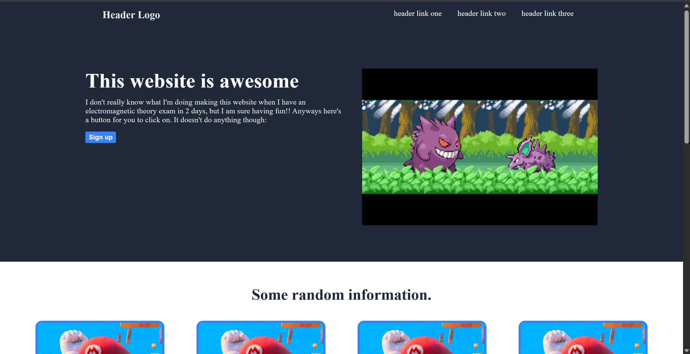

# Basic Landing Page

---

# Preview:


---

## What does it do?

- A modern looking landing page for a website using purely html and css. No frameworks, no JavaScript.
---

## How do I view it?

__There are mainly 2 ways to do so:__

1. Clone the repo onto your machine like so:
    ``` bash
    git clone https://github.com/omynayak/landing-page.git
    ```
    And then run the index.html file in your browser.
3. Head on over to:
   
   ```
   https://omynayak.github.io/landing-page/
   ```
   As it is currently hosted on GitHub pages.
